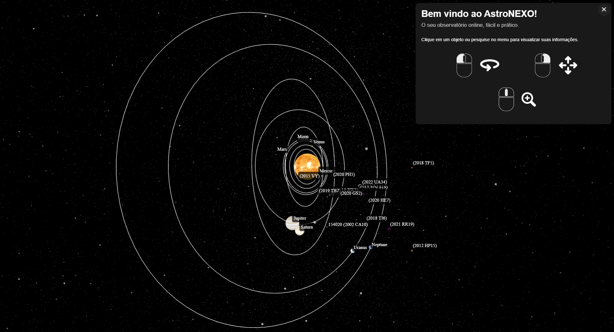
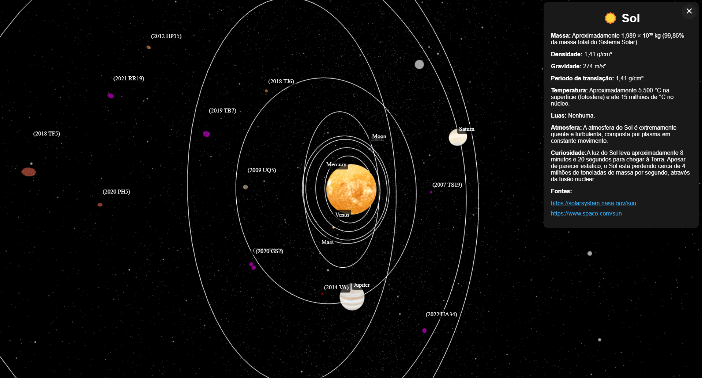

# 🪐 AstroNEXO: NASA Internation Space App Challenge

O projeto desenvolvido é um modelo 3D do Sistema Solar, ajustando-se ao tema proposto ao fornecer informações sobre objetos próximos ao planeta Terra, bem como sobre todo o Sistema Solar com todos os seus detalhes. O projeto é importante porque permite que estudantes, que não têm a oportunidade de visitar planetários reais, tenham um ao seu alcance. O aplicativo pode ser utilizado por escolas e instituições com menos recursos financeiros.

 

Projeto Demo: https://hackathon-nasa-2024.vercel.app/

---

Tecnologias:

- [ThreeJS](https://threejs.org/)

Colaboradores:

- [Eduardo Ballico](https://github.com/EduardoBllc)
- [Guilherme Brito](https://github.com/Glbdias)
- Miguel Longhi
- [Pedro Arraes](https://github.com/arraes544)
- [Thiago Ferreira](https://github.com/iamThiagoo)

Space Agency Data:

- [Nasa API](https://api.nasa.gov/)
- [App Nasa NeoWs](https://eyes.nasa.gov/apps/asteroids/#/home)

Referências:

- [ThreeJS Docs](https://eyes.nasa.gov/apps/asteroids/#/home)
- [Referência sobre Educação 1](https://www.astro4dev.org/case-studies/)
- [Referência sobre Educação 2](https://iau.org/education/strategic_plan/)
- [Referência sobre Educação 3](https://www.cambridge.org/core/journals/highlights-of-astronomy/article/fostering-science-education-in-the-developing-countries/FD75D03752341137E58505F56EFD64BF)
